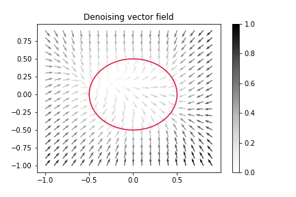
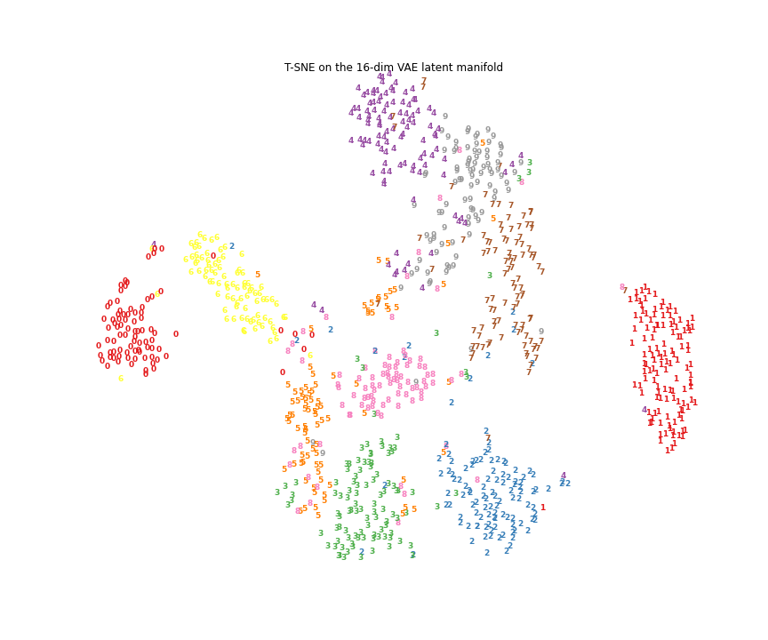

# Autoencoders

This repo contains simple explorations of autoencoders in different settings using Tensorflow and Keras.

- [Denoising autoencoders](https://github.com/danieltsoukup/autoencoders/blob/master/denoising_autoencoders.ipynb)

- [Convolutional variational autoencoders for dimension reduction](https://github.com/danieltsoukup/autoencoders/blob/master/variational_autoencoders.ipynb)

- Semantic hashing on text (TODO)

- Semi-supervised learning using autoencoders (TODO)

The notebooks contain some useful utility functions for tensorboard logging, constructing custom Keras models and training loops.
