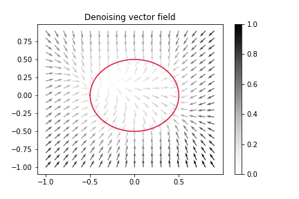
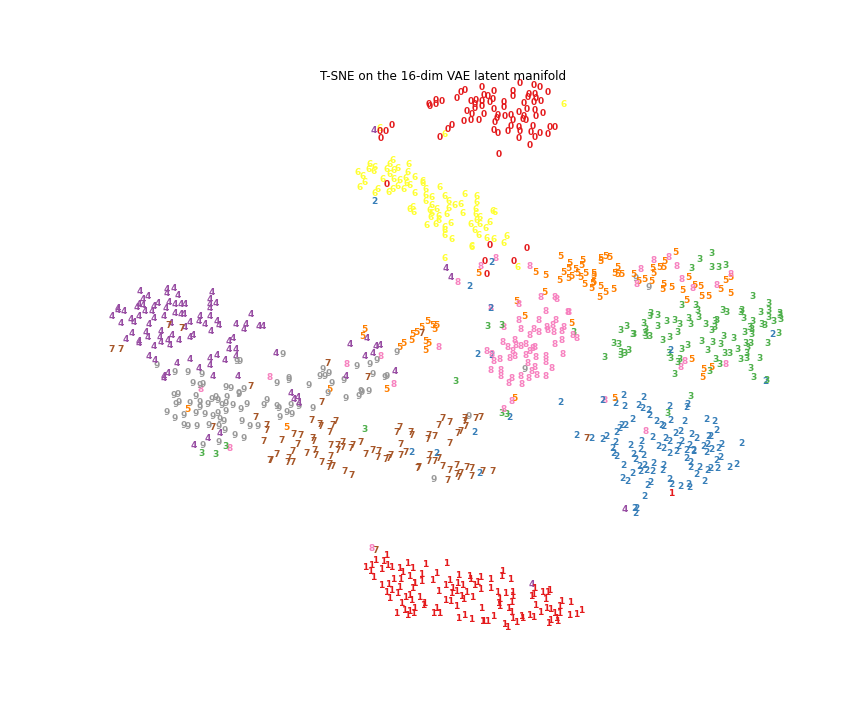
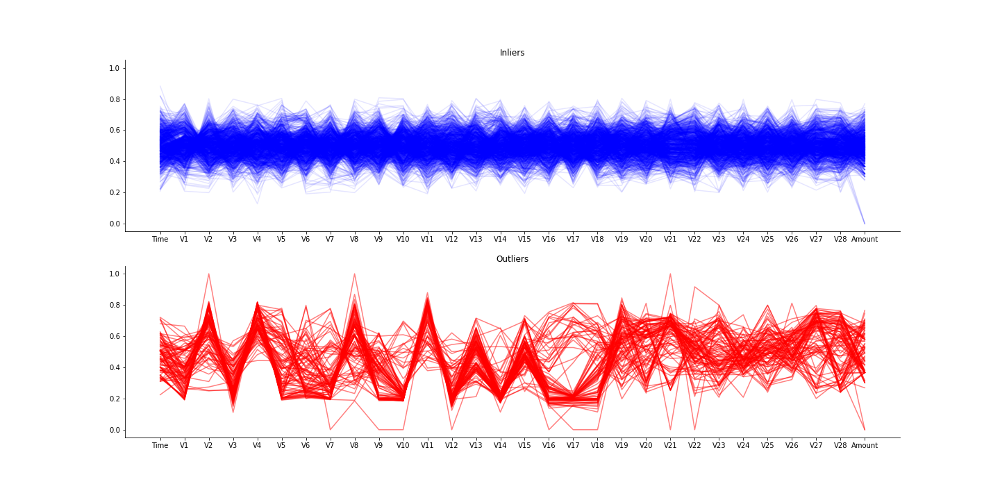

# Autoencoders

This repo contains simple explorations of autoencoders in different settings using Tensorflow and Keras.

- [Denoising autoencoders](https://github.com/danieltsoukup/autoencoders/blob/master/denoising_autoencoders.ipynb)

- [Convolutional variational autoencoders for dimension reduction](https://github.com/danieltsoukup/autoencoders/blob/master/variational_autoencoders.ipynb)

- [Randomized Autoencoder Ensembles for Outlier Detection](https://github.com/danieltsoukup/autoencoders/blob/master/outlier_detection_with_autoencoders.ipynb)

The notebooks contain
- useful utility functions for tensorboard logging,
- constructing custom Keras models such as with weight masking,
- custom training loops for variational autoencoders,
- custom data loaders that change the input per epoch for adaptive learning.

Resources:

- [Awesome anomaly detection resources](https://github.com/yzhao062/anomaly-detection-resources)